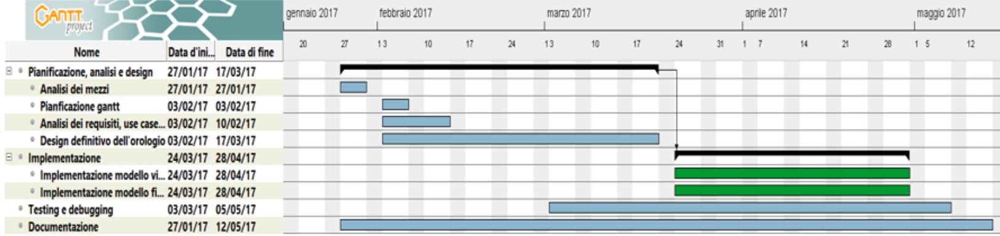

# Lavori svolti

1. Analisi dei requisiti (sottorequisiti)
2. Schema struttura modello fisico (compensato) su carta
3. Modello virtuale della struttura in compensato su SketchUp:  

4. Form di login per gestire il moello fisico
5. Colloquio per fare il punto della situazione
6. Gantt:  

# Problemi riscontrati e soluzioni

Nessuno

# Punto della situazione rispetto alla pianificazione

Iniziato questo giorno.

# Programma di massima per la prossima giornata

1. Iniziare la struttura in compensato
2. Continuare la struttura di login
