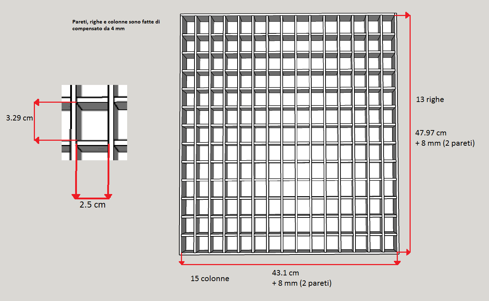

# Word Clock


1. [Introduzione](#introduzione)

  - [Informazioni sul progetto](#informazioni-sul-progetto)

  - [Abstract](#abstract)

  - [Scopo](#scopo)

2. [Analisi](#analisi)

  - [Analisi del dominio](#analisi-del-dominio)

  - [Analisi e specifica dei requisiti](#analisi-e-specifica-dei-requisiti)

3. [Use case](#use-case)

  - [Pianificazione](#pianificazione)

  - [Analisi dei mezzi](#analisi-dei-mezzi)

4. [Progettazione](#progettazione)

  - [Design dell’architettura del sistema](#design-dell’architettura-del-sistema)

  - [Design dei dati e database](#design-dei-dati-e-database)

5. [Implementazione](#Implementazione)

  - [Sviluppo](#Sviluppo)

  - [Test](#Test)

  - [Protocollo di test](#Protocollo-di-test)

  - [Risultati test](#Risultati-test)

  - [Mancanze/limitazioni conosciute](#Mancanze/limitazioni-conosciute)

6. [Consuntivo](#Consuntivo)

7. [Conclusioni](#Conclusioni)

  - [Sviluppi futuri](#Sviluppi-futuri)

  - [Considerazioni personali](#Considerazioni-personali)

8. [Bibliografia](#Bibliografia)

  - [Sitografia](#Sitografia)

9. [Allegati](#Allegati)


## Introduzione

### Informazioni sul progetto

Scuola SAMT - Scuola arti e mestieri Trevano

Sezione: Informatica

Materia: Modulo 306

Allievi:

- Samuel Dias Da Silva
- Loris Bruno
- Alessandro Narciso
- Massimo Saia
- Carlo Bogani


Docente responsabile:

- Adriano Barchi

Data di inizio: 27.01.2017

Data di fine: 11.05.2017

### Abstract

<!--Esempio di Abstract-->

  > The cookbooks are very present in kitchens, but   
  > sometimes those can be cumbersome.
  > For solve this problem there is the use of tecnology,   
  > some people use tablets, mobile phone, etc.
  > We were requested to realize a site of recipes's management.

### Scopo

Lo scopo del progetto è quello di realizzare un orologio a parole. Questo dovrà
essere presente in due modelli, uno fisico ed uno virtuale. Su quello fisico
verrà mostrata l'ora scritta con delle parole retroilluminate, questo sarà
controllato da quello virtuale sul quale verrà mostrata l'ora come nel modello
fisico. La parte fisica deve sincronizzarsi alla parte virtuale tramite Wi-Fi.

## Analisi

### Analisi del dominio

Con la tecnologia si fanno sempre più progressi, per questo con il tempo
gli orologi analogici non verranno più usati o magari anche dimenticati.
L'utilizzo del digitale sta avendo il soppravento in tutto e quindi per le strade o
nelle strutture come case ed uffici possiamo trovare un orologio numerico.

Il prodotto comprende una lettura diversa dal solito poiché l'ora verrà espressa
a parole, questo sarà accessibile a chiunque.


### Analisi e specifica dei requisiti

  |ID  |REQ-001                                         |
  |----|------------------------------------------------|
  |**Nome**    |Ergonomia |
  |**Priorità**|1                     |
  |**Versione**|1.0                   |
  |**Note**    ||
  |            |**Sotto requisiti** |
  |**001**  | L’orologio dovrà mostrare le ore in italiano secondi il modo di espressione corrente  |
  |**002**  | La posizione delle parole dovrà essere ottimizzata per una facile lettura   |
  |**003**  | Dovrà avere una risoluzione minima di cinque minuti   |
  |**004**  | L’intervallo tra i cinque minuti dovrà essere mostrato con una rappresentazione grafica intuitiva, risoluzione minima di un minuto. Considerare eventualmente anche una rappresentazione dei secondi.  |

  |ID  |REQ-002                                         |
  |----|------------------------------------------------|
  |**Nome**    |Modello fisico |
  |**Priorità**|1                     |
  |**Versione**|1.0                   |
  |**Note**    ||
  |            |**Sotto requisiti** |
  |**001**  | Il sistema di controllo del display a parole dovrà comunque già essere dimensionato, oppure prevedere un’espansione, per controllare un modello più grande di ca. 2m x 2m  |
  |**002**  | Il modello fisico dovrà essere alimentato autonomamente ed essere sincronizzato automaticamente (tramite Wi-Fi sui diversi time server a disposizione)  |
  |**003**  | In caso di interruzione di alimentazione, un RTC alimentato a batteria dovrà mantenere l’ora sincronizzata in modo che al ritorno dell’alimentazione, l’orologio sia già corretto  |
  |**004**  | Il modello fisico dovrà poter essere controllato (accensione, correzione dell’ora) anche direttamente onboard  |

  |ID  |REQ-003                                         |
  |----|------------------------------------------------|
  |**Nome**    |Modello virtuale |
  |**Priorità**|1                     |
  |**Versione**|1.0                   |
  |**Note**    ||
  |            |**Sotto requisiti** |
  |**001**  | Il modello virtuale dovrà avere la stessa rappresentazione grafica di quello fisico |
  |**002**  | Sincronizzazione con il modello fisico |
  |**003**  | Tramite un accesso ristretto dovrà permettere di controllare il modello fisico e di testarne l’integrità permettendo l’accensione simultanea di tutti i led   |

### Use case


In questo schema abbiamo rappresentato tutti i rispettivi casi dell'applicativo
web (modello virtuale).

### Pianificazione


Le attività evidenziate di colore verde nel diagramma di Gantt, sono in parallelo.

### Analisi dei mezzi

Questo prodotto sarà compreso in un costrutto di legno per il modello fisico, ed
in un web server per il modello virtuale.   

I mezzi per realizzare il tutto sono i seguenti:

- Arduino Ethernet: per il funzionamento del modello fisico

- 195 LED da 25 mA: per illuminare le varie lettere

- 195 resistenze da 390 Ohm: utili ai LED

- Alimentatore 12 V: per alimentare il modello fisico

- 2 tavole di  compensato 50cm X 50cm spesso 8mm: per la base della griglia

- 4 tavole di compensato 297mm X 420mm spesso 4mm: per la base della griglia

- 28 mosfet: per gestire la matrici di LED

- Plexiglass 40cm X 40cm: utile al modello fisico

- 4 demultiplexer 4051

- Attrezzi utili (saldatore, scotch, ecc...)

### Analisi dei costi

I costi per la realizzazione del progetto sono 50 CHF / h(ora).
Sono previsite 100 ore lavorative, per un totale di 5000 CHF.

## Progettazione

### Design dell’architettura del sistema



Nell'immagine sovrastante è rappresenatato la versione fisica del Word Clock,
nelle varie celle verranno visualizzate le lettere necessarie. Le misure prese
sono quelle imposte nel mandato. Il contenitore è composto principalmente di
compensato a parte le sue separazioni all'interno che sono di poli(qualcosa),
quest'ultimo è stato usato per rendere il tutto più flessibile in modo da
prevenire eventuali incidenti.


In immagine viene mostrato, nello specifico, l'altezza e lo spessore
della parte superiore del supporto, le misure sono visibili nell'immagine.


Qua viene rappresentato tutto il contenitore, in cui e ben visibile lo spazio
sottostante che ospiterà la scheda Arduino, le due Veroboard e l'alimentatore.

### Design delle interfacce

Nel modello virtuale l'interfaccia grafica si presenta nel seguente modo:
* Al centro si trova l'orologio a parole.  
* Alla sinisra di questo ci sono i pallini che indicano i secondi. Ogni pallino equivale a 5 secondi; il pallino più in alto è 5 secondi.  
* Sopra alle lettere c'è l'indicatore dei minuti. Il più e il meno indicano se aggiungere o togliere minuti all'orario letto dalle parole. Ogni pallino vale 1 minuto; il pallino più a sinistra indica che si deve aggiungere/togliere 1 minuto, mentre quello più a destra indica che si devono aggiungere/togliere 4 minuti.  
* In alto a sinistra si trova il menu, nel quale si potrà modificare la lingua e i colori dell'interfaccia. Ci saranno dei temi già preimpostati.
* In alto a destra si trova il pulsante per effettuare il login/logout.  

Le immagini seguenti mostrano l'interfaccia nelle diverse lingue:

### Italiano  
  

### Tedesco  
  

### Francese   
  

Il menu è diviso in 3 parti prinipali:
* LINGUA: per passare da una lingua ad un'altra
* TEMI PREDEFINITI: per impostare i colori dell'interfaccia tramite dei temi preimpostati
* COLORI PERSONALIZZATI: per impostare i colori dell'interfaccia come si vuole

Una volta effettuato il login apparirà nel menu la voce "Gestisci LED", nella quale si potrà abilitare la gestione dei singoli LED sincronizati con il modello fisco.

SCREEN MENU PROGETTAZIONE

## Implementazione

### Modello virtuale
Per il modello virtuale abbiamo iniziato con un WordClock di base già fatto in un altro progetto.
Questo si presentava nel seguente modo:  


Abbiamo dovuto modificare la struttura im modo da renderla come illustrata nella progettazione:


Per far sì che la tabella delle lettere rimanga al centro abbiamo creato una funzione che la riadatta a dipendenza dello spazio a disposizione: se la finestra è più larga che alta, la tabella si ridimensiona rispetto all'altezza:  


mentre se la finestra è più alta che larga la tabella si ridimensiona rispetto alla larghezza:  


La struttura principale è una tabella 15x13.  
Ogni riga possiede un id che va da 0 a 120 con intervalli di 10. All'inizio di ogni riga di lettere si trova il pallino dei secondi creato con &#8226.   
Questo è un esempio di riga:  

```html
<tr id="10">
  <td><span class="sec_point" id="s5"  title="5 secondi">&#8226</span></td>
  <td>È</td>
  <td>S</td>
  <td>O</td>
  <td>N</td>
  <td>O</td>
  <td>T</td>
  <td>L</td>
  <td>E</td>
  <td>I</td>
  <td>L</td>
  <td>'</td>
  <td>U</td>
  <td>N</td>
  <td>A</td>
</tr>
```
Per "accendere" le lettere che mostrano l'ora attuale abbiamo creato una funzione che riceve come parametri la riga, l'indice da cui iniziare a colorare e quello di fine e il colore da applicare.  
La funzione è la seguente:

```javascript  
function genWord(row, min, max, color) {
  // Prendo tutti gli elemnti della riga
  var els = document.getElementById(row).getElementsByTagName("td");
  for(var x = min+1; x <= max+1; x++){
    // Applico il colore alle lettere da accendere / spegnere
    els[x].style.color = color;
    if(color == on) els[x].style.textShadow = "0 3px 6px rgba(0,0,0,0.16), 0 3px 6px rgba(0,0,0,0.23)";
    if(color == off) els[x].style.textShadow = "";
  }
}
```

Come da progettazione il menu è composto da 3 sezioni.  
La prima sezione è quella della lingua. In questa sezione si può passare dalla pagina di una lingua a quella di una della altre due disponibili.  
La seconda sezione permette di cambiare i colori dell'interfaccia tramite tre temi predefiniti.  
La terza sezione permette di cambiare i colori dell'interfaccia definendo i colori dello sfondo, delle lettere accese e di quelle spente, tramite degli input RGB.

AGGIORNARE IMG  


Una volta effettuato il login apparirà nel menu la sezione per poter gesire i LED del modello fisico e in alto a destra appariranno i bottoni per cambiare la password dell'account ed effettuare il logout.

IMG SEZIONE MANAGEMENT

IMG BOTTONI LOGOUT E CAMBIO PWD

### Modello fisico


## Test

### Protocollo di test

|Test Case      | TC-001                               |
|---------------|--------------------------------------|
|**Nome**       |Modello virtuale con la stessa rappresentazione di quello fisico|
|**Riferimento**|REQ-003                               |
|**Descrizione**|Controllare che il modello virtuale abbia la stessa rappresentazione di quello virtuale (per la lingua italiana) |
|**Prerequisiti**| |
|**Procedura**     |1. Nel sito, andare, se non si è già nella pagina del WordClock in italiano tramite il menu sulla sinistra. <br> 2. Controllare che la disposizione delle lettere sia uguale a quella rapresentata nel modello fisico.  |
|**Risultati attesi** |Non ci deve essere nessuna differenza tra i due. |

|Test Case      | TC-002                               |
|---------------|--------------------------------------|
|**Nome**       |Sincronizzazione virtuale-fisico|
|**Riferimento**|REQ-003                               |
|**Descrizione**|Controllare che il modello fisico e quello virtuale siano sincronizzati  |
|**Prerequisiti**|Bisogna essere nella pagina in italiano |
|**Procedura**     |1. Nel sito, andare, se non si è già nella pagina del WordClock in italiano tramite il menu sulla sinistra. <br> 2. Controllare che i LED accesi nel modello fisico siano gli stessi che sono colorati nel modello virtuale  |
|**Risultati attesi** |I LED accesi nel modello fisico devono essere gli stessi che sono colorati nel modello virtuale. |

|Test Case      | TC-003                               |
|---------------|--------------------------------------|
|**Nome**       |Accesso ristretto per controllare il modello fisico|
|**Riferimento**|REQ-003                               |
|**Descrizione**|Effettuare il login e testare l'accensione dei LED tramite il modello virtuale |
|**Prerequisiti**| |
|**Procedura**     |1. Cliccare sul pulsante di login in alto a destra.<br>2. Mettere le credenziali.<br>3. Cliccare sulle lettere  per cambiarne lo stato e verificare che lo stato cambi pure nel modello fisico.<br>4. Provare ad accendere tutti i LED del modello fisico tramite interfaccia virtuale.  |
|**Risultati attesi** |Cambiando lo stato di una lettera nel modello virtuale, viene cambiato lo stato di quella stessa lettera pure nel modello fisico. |

|Test Case      | TC-004                               |
|---------------|--------------------------------------|
|**Nome**       ||
|**Riferimento**|REQ-0                               |
|**Descrizione**| |
|**Prerequisiti**| |
|**Procedura**     |  |
|**Risultati attesi** |risultati |

|Test Case      | TC-005                               |
|---------------|--------------------------------------|
|**Nome**       ||
|**Riferimento**|REQ-0                               |
|**Descrizione**| |
|**Prerequisiti**| |
|**Procedura**     |  |
|**Risultati attesi** |risultati |


### Risultati test

### Mancanze/limitazioni conosciute

Le mancanze e limitazioni principali del prodotto finale sono:

-
-

## Consuntivo

Consuntivo del tempo di lavoro effettivo e considerazioni riguardo le
differenze rispetto alla pianificazione (cap 1.7) (ad esempio Gannt
consuntivo).

## Conclusioni

### Sviluppi futuri

Non vi è nessuna intenzione di effettuare dei miglioramenti al progetto,
in futuro. Chiaramente l'idea principale di completarlo in modo che tutte
le opzioni imposte siano portate a termine, perché è molto interessante
vedere come si comporta quando sarà tutto completo.

### Considerazioni personali
  Cosa ho imparato in questo progetto? ecc

## Bibliografia

### Sitografia

1.  URL del sito (se troppo lungo solo dominio, evt completo nel
    diario),

2.  Eventuale titolo della pagina (in italico),

3.  Data di consultazione (GG-MM-AAAA).

**Esempio:**

-   http://standards.ieee.org/guides/style/section7.html, *IEEE
    Standards Style Manual*, 07-06-2008.

## Allegati

-   Diari di lavoro

-   Codici sorgente

-   Mandato / Quaderno dei compiti

-   Prodotto
