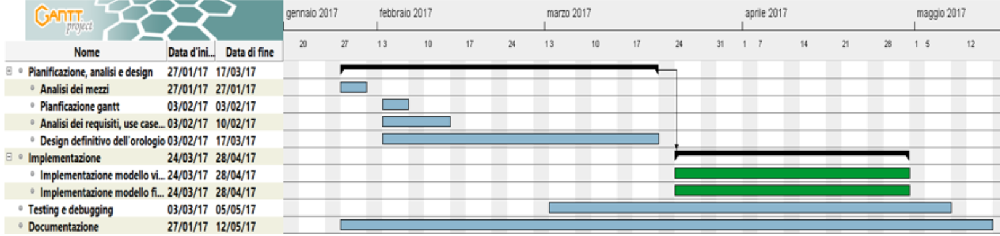
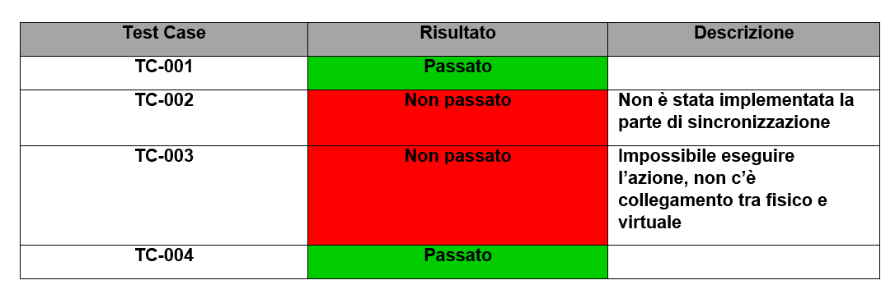

# Word Clock


1. [Introduzione](#introduzione)

  - [Informazioni sul progetto](#informazioni-sul-progetto)

  - [Abstract](#abstract)

  - [Scopo](#scopo)

2. [Analisi](#analisi)

  - [Analisi del dominio](#analisi-del-dominio)

  - [Analisi e specifica dei requisiti](#analisi-e-specifica-dei-requisiti)

3. [Use case](#use-case)

  - [Pianificazione](#pianificazione)

  - [Analisi dei mezzi](#analisi-dei-mezzi)

4. [Progettazione](#progettazione)

  - [Design dell’architettura del sistema](#design-dell’architettura-del-sistema)

  - [Design dei dati e database](#design-dei-dati-e-database)

5. [Implementazione](#Implementazione)

  - [Sviluppo](#Sviluppo)

  - [Test](#Test)

  - [Protocollo di test](#Protocollo-di-test)

  - [Risultati test](#Risultati-test)

  - [Mancanze/limitazioni conosciute](#Mancanze/limitazioni-conosciute)

6. [Consuntivo](#Consuntivo)

7. [Conclusioni](#Conclusioni)

  - [Sviluppi futuri](#Sviluppi-futuri)

  - [Considerazioni personali](#Considerazioni-personali)

8. [Bibliografia](#Bibliografia)

  - [Sitografia](#Sitografia)

9. [Allegati](#Allegati)


## Introduzione

### Informazioni sul progetto

Scuola SAMT - Scuola arti e mestieri Trevano

Sezione: Informatica

Materia: Modulo 306

Allievi:

- Samuel Dias Da Silva
- Loris Bruno
- Alessandro Narciso
- Massimo Saia
- Carlo Bogani


Docente responsabile:

- Adriano Barchi

Data di inizio: 27.01.2017

Data di fine: 12.05.2017

### Abstract

  > You don't know what time is it, but you don't have a clock?
  > This clock represented by words is here for you.
  > We created a simple and clean design for give you an easy
  > and fast read of it.
  > In this way you don't have anymore the need to ask it to anybody else.
  > This WordClock won't be the helpful clock that you may need, but it will
  > surely be the greatest and coolest you have ever seen!
  > Anywhere you'll put it will always be gorgeous to look at.


### Scopo

Lo scopo del progetto è quello di realizzare un orologio a parole. Questo dovrà
essere presente in due modelli, uno fisico ed uno virtuale. Su quello fisico
verrà mostrata l'ora scritta con delle parole retroilluminate, questo sarà
controllato da quello virtuale sul quale verrà mostrata l'ora come nel modello
fisico. La parte fisica deve sincronizzarsi alla parte virtuale tramite Wi-Fi.


## Analisi

### Analisi del dominio

Con la tecnologia si fanno sempre più progressi, per questo con il tempo
gli orologi analogici non verranno più usati o magari anche dimenticati.
L'utilizzo del digitale sta avendo il soppravento in tutto e quindi per le strade o
nelle strutture come case ed uffici possiamo trovare un orologio numerico.

Il prodotto comprende una lettura diversa dal solito poiché l'ora verrà espressa
a parole, questo sarà accessibile a chiunque.


### Analisi e specifica dei requisiti

  |ID  | REQ-001                                         |
  |:----|:------------------------------------------------|
  |**Nome**    |Ergonomia |
  |**Priorità** | 1                     |
  |**Versione** | 1.0                   |
  |**Note**    | |
  |            |**Sotto requisiti** |
  |**001**  | L’orologio dovrà mostrare le ore in italiano secondi il modo di espressione corrente  |
  |**002**  | La posizione delle parole dovrà essere ottimizzata per una facile lettura   |
  |**003**  | Dovrà avere una risoluzione minima di cinque minuti   |
  |**004**  | L’intervallo tra i cinque minuti dovrà essere mostrato con una rappresentazione grafica intuitiva, risoluzione minima di un minuto. Considerare eventualmente anche una rappresentazione dei secondi.  |


  |ID  |REQ-002                                         |
  |:----|:------------------------------------------------|
  |**Nome**    |Modello fisico |
  |**Priorità** |1                     |
  |**Versione** |1.0                   |
  |**Note**    ||
  |            |**Sotto requisiti** |
  |**001**  | Il sistema di controllo del display a parole dovrà comunque già essere dimensionato, oppure prevedere un’espansione, per controllare un modello più grande di ca. 2m x 2m  |
  |**002**  | Il modello fisico dovrà essere alimentato autonomamente ed essere sincronizzato automaticamente (tramite Wi-Fi sui diversi time server a disposizione)  |
  |**003**  | In caso di interruzione di alimentazione, un RTC alimentato a batteria dovrà mantenere l’ora sincronizzata in modo che al ritorno dell’alimentazione, l’orologio sia già corretto  |
  |**004**  | Il modello fisico dovrà poter essere controllato (accensione, correzione dell’ora) anche direttamente onboard  |

  |ID  |REQ-003                                         |
  |:----|:------------------------------------------------|
  |**Nome**    |Modello virtuale |
  |**Priorità** |1                     |
  |**Versione** |1.0                   |
  |**Note**    ||
  |            |**Sotto requisiti** |
  |**001**  | Il modello virtuale dovrà avere la stessa rappresentazione grafica di quello fisico |
  |**002**  | Sincronizzazione con il modello fisico |
  |**003**  | Tramite un accesso ristretto dovrà permettere di controllare il modello fisico e di testarne l’integrità permettendo l’accensione simultanea di tutti i led   |

### Use case


In questo schema abbiamo rappresentato tutti i rispettivi casi dell'applicativo
web (modello virtuale).

Lo use case presenta tre attori principali: il sito, l'amministratore e l'utente ospite.

Il primo attore è il sito che fornirà al modello fisico e all'utente ospite l'orario, inoltre, quest'ultimo avrà il controllo sul modello fisico.

Il secondo potrà testare i led del modello fisico e modificarne pure l'orario, ma per fare ciò dovrà prima eseguire il login da amministratore sul sito.

Il terzo attore é l'utente ospite che potrà leggere l'orario fornito dal primo attore, il sito.

In questo schema abbiamo rappresentato tutti i rispettivi casi dell'applicativo web (modello virtuale).

### Pianificazione



Le attività evidenziate di colore verde nel diagramma di Gantt, sono in parallelo.

### Analisi dei mezzi

Questo prodotto sarà compreso in un costrutto di legno per il modello fisico, ed
in un web server per il modello virtuale.   

I mezzi per realizzare il tutto sono i seguenti:

- Arduino Ethernet: per il funzionamento del modello fisico

- 195 LED da 25 mA: per illuminare le varie lettere

- 195 resistenze da 390 Ohm: utili ai LED

- Alimentatore 12 V e 5 A: per alimentare il modello fisico

- 2 tavole di  compensato 50cm X 50cm spesso 8mm: per la base della griglia

- 4 tavole di compensato 297mm X 420mm spesso 4mm: per la base della griglia

- 28 mosfet: per gestire la matrici di LED

- Plexiglass 40cm X 40cm: utile al modello fisico

- Policarbonato per costruire le varie celle della griglia.

- 4 demultiplexer 74HC4051

- Attrezzi utili (saldatore, scotch, ecc...)

- Linguaggi HTML e CSS: utilizzati per l'interfaccia grafica

- Linguaggi Php, MySQL, JavaScript: utilizzati per la gestione del sito

- GanttProject 2.8.1 Pilsen, software utilizzato per sviluppare il diagramma di Gantt

- Adobe Photoshop CC 2017: utilizzato per realizzare l'immagine scalare

- KiCad 4.0.6: utilizzato per realizzare alcuni schemi elettrici

### Analisi dei costi

I costi per la realizzazione del progetto sono 50 CHF / h(ora).
Sono previsite 100 ore lavorative, per un totale di 5000 CHF.

## Progettazione

### Design dell’architettura del sistema


Nell'immagine sovrastante è rappresenatato la versione fisica del Word Clock,
nelle varie celle verranno visualizzate le lettere necessarie. Le misure prese
sono quelle imposte nel mandato. Il contenitore è composto principalmente di
compensato a parte le sue separazioni all'interno che sono di policarbonato,
quest'ultimo è stato usato per rendere il tutto più flessibile in modo da
prevenire eventuali incidenti.


In immagine viene mostrato, nello specifico, l'altezza e lo spessore
della parte superiore del supporto, le misure sono visibili nell'immagine.


Qua viene rappresentato tutto il contenitore, in cui e ben visibile lo spazio
sottostante che ospiterà la scheda Arduino, le due Veroboard e l'alimentatore.

#### Matrice

Per controllare singolarmente tutti i led abbiamo progettato una matrice a mosfet.
I mosfet sono degli switch elettronici che dispongono di 3 pin.
Il primo pin è il gate il quale, tramite un segnale digitale, può cambiare lo stato
dello switch. Mettendo un `1` lo switch chiuderà il circuito lasciando passare
la corrente che gli arriva secondo pin al terzo pin.


Questi sono posizionati all'inizio di ogni colonna, ed alla fine di ogni riga.
Tutti i mosfet collegati alle colonne sono direttamente collegate alla corrente
e al polo positivo dei vari diodi.
Anche nelle varie righe vi é un mosfet alla quale vi sono collegati tutti i poli
negativi dei led nella riga corrispondente. Il polo negativo del mosfet in questo
caso viene collegato direttamente al polo negativo.
Utilizzando un alimentatore esterno per i led e controllando i mosfet da Arduino,
bisognerà in seguito sincronizzare il polo negativo, perciò oltre a collegare il
`GND` dell'alimentatore esterno, bisognerà collegare anche il `GND` di arduino.

Il fatto che la corrente percorre la strada più corta per arrivare a massa si
può sfruttare per selezionare i singoli led.
Per esempio: per accendere il primo led a sinistra della matrice basterà mettere
un `1` alla prima colonna ed un `1` alla prima riga.

Con l'utilizzo dei mosfet abbiamo ridotto molto drasticamente la quantità di pin
necessari, da 195 per ogni led a 28 pin.
Ma siccome arduino ethernet possiede solamente 13 porte utilizzabili, dovevamo
trovare un modo per ridurre ancora di più il numero di porte necessarie.
Perciò abbiamo pensato all'utilizzo di `4` demultiplexer a 3 bit, in modo tale
da avere come minimo 7 uscite utilizzabili per ogni demultiplexer.
Utilizzando i demultiplexer utilizzavamo `6` pin di arduino per i vari selettori
dei demultiplexer, `2` pin per il dato che si deve trasmettere al demultiplexer,
e `2` per l'`INH` dei vari demultiplexer. Tutte gli ingressi sono condivisi
tra i due demultiplexer sulla stessa base. I selettori sono condivisi, il dato è
condiviso e l'`INH` viene negato al secondo demultiplexer.


### Design delle interfacce

Nel modello virtuale l'interfaccia grafica si presenta nel seguente modo:
* Al centro si trova l'orologio a parole.  
* Alla sinisra di questo ci sono i pallini che indicano i secondi. Ogni pallino
equivale a 5 secondi; il pallino più in alto è 5 secondi.  
* Sopra alle lettere c'è l'indicatore dei minuti. Il più e il meno indicano se
aggiungere o togliere minuti all'orario letto dalle parole. Ogni pallino vale
1 minuto; il pallino più a sinistra indica che si deve aggiungere/togliere 1
minuto, mentre quello più a destra indica che si devono aggiungere/togliere 4
minuti.  
* In alto a sinistra si trova il menu, nel quale si potrà modificare la lingua
e i colori dell'interfaccia. Ci saranno dei temi già preimpostati.
* In alto a destra si trova il pulsante per effettuare il login/logout.

Questa è l'interfaccia del modello virtuale che verrà visualizzata dall'utente
che non ha effettuato il login. Nel parte centrale saranno mostrate le lettere, a
differenza della lingua selezionata.


Le immagini seguenti mostrano l'interfaccia nelle diverse lingue:

### Italiano  
  

### Tedesco  
  

### Francese   
  

Il menu è diviso in 3 parti prinipali:
* LINGUA: per passare da una lingua ad un'altra
* TEMI PREDEFINITI: per impostare i colori dell'interfaccia tramite dei temi
preimpostati
* COLORI PERSONALIZZATI: per impostare i colori dell'interfaccia come si vuole

Una volta effettuato il login apparirà nel menu la voce "Gestisci LED", nella
quale si potrà abilitare la gestione dei singoli LED sincronizzati con il
modello fisco.

Questa è l'interfaccia di Login, per accerdere bisognerà inserire username e
password.


Questa è l'interfaccia del modello virtuale che verrà visualizzata dall'utente
che ha effettuato il login. Verrà aggiunto il bottone utile per il cambio password.


Questa è l'interfaccia del cambio di password.


Infine, questa è l'interfaccia del menu, sarà accessibile con il tasto in alto a
sinistra nella pagina princiaple, questo permette di :

- cambiare lingua

- cambiare il tema dei colori, sono già presenti dei temi predefiniti

- personalizzazione dei colori

L'interfaccia per visualizzare l'ora corrente, utile al modello fisico è
stata realizzata un'immagine scalare, su misura.


## Implementazione

### Modello virtuale
Per il modello virtuale abbiamo iniziato con un WordClock di base già fatto in
un altro progetto.
Questo si presentava nel seguente modo:  


Abbiamo dovuto modificare la struttura im modo da renderla come illustrata nella
progettazione:


Per far sì che la tabella delle lettere rimanga al centro abbiamo creato una
funzione che la riadatta a dipendenza dello spazio a disposizione: se la
finestra è più larga che alta, la tabella si ridimensiona rispetto all'altezza:  


mentre se la finestra è più alta che larga la tabella si ridimensiona rispetto alla larghezza:  


La struttura principale è una tabella 15x13.  
Ogni riga possiede un id che va da 0 a 120 con intervalli di 10. All'inizio di
ogni riga di lettere si trova il pallino dei secondi creato con &#8226.   
Questo è un esempio di riga:  

```html
<tr id="10">
  <td><span class="sec_point" id="s5"  title="5 secondi"> o </span></td>
  <td>È</td>
  <td>S</td>
  <td>O</td>
  <td>N</td>
  <td>O</td>
  <td>T</td>
  <td>L</td>
  <td>E</td>
  <td>I</td>
  <td>L</td>
  <td>'</td>
  <td>U</td>
  <td>N</td>
  <td>A</td>
</tr>
```
Per "accendere" le lettere che mostrano l'ora attuale abbiamo creato una
funzione che riceve come parametri la riga, l'indice da cui iniziare a colorare
e quello di fine e il colore da applicare.  
La funzione è la seguente:

```javascript  
function genWord(row, min, max, color) {
  // Prendo tutti gli elemnti della riga
  var els = document.getElementById(row).getElementsByTagName("td");
  for(var x = min+1; x <= max+1; x++){
    // Applico il colore alle lettere da accendere / spegnere
    els[x].style.color = color;
    if(color == on) els[x].style.textShadow = "0 3px 6px rgba(0,0,0,0.16), 0 3px 6px rgba(0,0,0,0.23)";
    if(color == off) els[x].style.textShadow = "";
  }
}
```

Come da progettazione il menu è composto da 3 sezioni.  
La prima sezione è quella della lingua. In questa sezione si può passare dalla
pagina di una lingua a quella di una della altre due disponibili.  
La seconda sezione permette di cambiare i colori dell'interfaccia tramite tre
temi predefiniti.  
La terza sezione permette di cambiare i colori dell'interfaccia definendo i
colori dello sfondo, delle lettere accese e di quelle spente, tramite degli
input RGB.


Una volta effettuato il login apparirà nel menu la sezione per poter gesire i
LED del modello fisico e in alto a destra appariranno i bottoni per cambiare la
password dell'account ed effettuare il logout.  

### Modello fisico

Per la costruzione dello `scheletro` del wordclock se ne è occupato il nostro
docente `Adriano Barchi`.

Per costruire le varie "celle" dei led abbiamo utilizzato delle basi in
`policarbonato`. Abbiamo tagliato 15 pareti lunghe quanto la altezza della base
e alte quanto la altezza che c'è dal punto in cui si appoggia la base di compensato
ed il punto su cui si appoggia il plexiglass.
Per le righe abbiamo tagliato 13 pareti lunghe quanto la larghezza della base
in compensato e anche queste alte quanto la altezza che c'è dal punto in cui si
appoggia la base di compensato ed il punto su cui si appoggia il plexiglass.
In seguito su ogni colonna abbiamo formato dei fori, a distanza di 3,29 `cm`
l'uno dall'altro, a forma di rettangoli nei quali in seguito si dovrebbero
incastrare le strisce delle righe.
La stessa cosa l'abbiamo applicata per le pareti delle righe, a differenza che
in queste la spaziatura  tra i vari fori è di 2.5 `cm`.

I vari mosfet e demultiplexer li abbiamo saldati tutti su due basette,
una per le righe e una per le colonne.


Successivamente abbiamo preso la base su cui in seguito avremmo dovuto posizionare
i led, abbiamo tracciato con una matita i rettangoli della griglia e
successivamente abbiamo disegnato le diagonali di questi ultimi. All'incrocio di
delle diagonali abbiamo fatto un foro. Questo procedimento lo abbiamo applicato
a tutta la griglia.

Successivamente abbiamo posizionato i vari led all'interno dei fori.

Per fare le righe e le colonne che dovrebbero collegare i vari led, vedi capitolo
matrice, abbiamo preso dei filamenti argentati lunghi quanto la larghezza
o altezza, rispettivamente.
In seguito, sul retro della base, abbiamo aperto la gambetta del led che viene
collegata alla resistenza (anodo).

Per le colonne abbiamo tagliato il filamento argentato, lungo quanto la altezza
della base, ed in seguito tracciato i punti su cui cade la gamba del led nella
colonna rispettiva. Dopodiché una persona teneva una gamba della resistenza sopra
il filamento argentato in modo perpendicolare, mentre l'altra persona applicava
una saldatura sulla resistenza e il filamento. Questo procedimento l'abbiamo
applicato 13 volte per colonna per 15 colonne, per un totale di 195 resistenze.
Successivamente abbiamo posizionato i vari filamenti, cercando di far sì che
la gamba della resistenza cadesse sopra l'anodo del led corispettivo, ed in seguito
saldando la resistenza al led. Tutto questo per tutte le colonne.

Per le righe abbiamo preso il filamento argentato, lungo quanto la larghezza
della base, lo abbiamo applicato sopra i vari led e abbiamo saldato i primi due
che si trovano alle estremità della riga, anche qui uno che teneva ed uno che
saldava, in modo tale che per tutti i led restanti della riga potessero essere
saldati senza che uno tenesse attaccati il filamento al catodo del led.

In seguito abbiamo utilizzato dei cavetti di rame (estremamente flessibili) per
saldare le ogni colonna sul mosfet corispettivo sulla basetta delle colonne.
Per saldare il cavetto sulla griglia, uno teneva il cavetto e l'altro saldava.
Anche per le righe abbiamo utilizzato lo stesso procedimento, eccetto che in
questo caso i vari cavetti vanno collegati al mosfet corispettivo
nella basetta delle righe.
Per le colonne abbiamo utilizzato dei cavetti `rossi`.
Per ler righe abbiamo utilizzato dei cavetti `neri`.

Dopodiché abbiamo saldato il pin gate del mosfet all'uscita corispettiva del
demultiplexer. Qui abbiamo capito che questo procedimento l'avremmo dovuto fare
prima di saldare i vari mosfet, perché la distanza tra questi non era molta
e perciò era difficile infilare la parte di rame nel foro giusto.

Siccome ci sono due demultiplexer per le colonne e due demultiplexer per le
righe, abbiamo deciso di rendere gli ingressi `A, B, C` dei multipli demultiplexer
sullo stesso piano condivisi, così da non sprecare porte di arduino. Perciò
abbiamo preso una basetta piccola intermedia, che viene collegata a arduino, ed
in seguito va sui due demultiplexer (righe o colonne). Inoltre, facciamo la
stessa cosa per gli ingressi `INH`, il primo demultiplexer prende il segnale
non negato, mentre il secondo lo prende negato, dalla stessa porta.
I cavetti utilizzati per i segnali digitali o analogici (simulano quelli digitali)
sono arancioni.


## Test

### Protocollo di test


| Test Case            | TC-001                                                                                                                                                                                                                 |
|:---------------------|:-----------------------------------------------------------------------------------------------------------------------------------------------------------------------------------------------------------------------|
| **Nome**             | Modello virtuale con la stessa rappresentazione di quello fisico                                                                                                                                                       |
| **Riferimento**      | REQ-003                                                                                                                                                                                                                |
| **Descrizione**      | Controllare che il modello virtuale abbia la stessa rappresentazione di quello virtuale (per la lingua italiana)                                                                                                       |
| **Prerequisiti**     |                                                                                                                                                                                                                        |
| **Procedura**        | 1. Nel sito, andare, se non si è già nella pagina del WordClock in italiano tramite il menu sulla sinistra. <br> 2. Controllare che la disposizione delle lettere sia uguale a quella rapresentata nel modello fisico. |
| **Risultati attesi** | Non ci deve essere nessuna differenza tra i due.                                                                                                                                                                       |

| Test Case            | TC-002                                                                                                                                                                                             |
|:---------------------|:----------------------------------------------------------------------------------------------------------------------------------------------------------------------------------------------------|
| **Nome**             | Sincronizzazione tra modello virtuale e fisico                                                                                                                                                      |
| **Riferimento**      | REQ-003                                                                                                                                                                                             |
| **Descrizione**      | Sincronizzazione con il modello fisico                                                                                                                                                              |
| **Prerequisiti**     | Il sito e il modello fisico devono potersi comunicare via internet                                                                                                                                  |
| **Procedura**        | 1. Eseguire il login come amministratore sul modello virtuale<br>2.Modificare l'orario tramite la toolbox apposita.<br>3. Controllare che il modello fisico abbia cambiato effettivamente l'orario. |
| **Risultati attesi** | L'orario del modello virtuale e del modello fisico devono combaciare.                                                                                                                               |

| Test Case            | TC-003                                                                                                                                                                                                                                                                                  |
|:---------------------|:----------------------------------------------------------------------------------------------------------------------------------------------------------------------------------------------------------------------------------------------------------------------------------------|
| **Nome**             | Accesso ristretto per controllare il modello fisico                                                                                                                                                                                                                                     |
| **Riferimento**      | REQ-003                                                                                                                                                                                                                                                                                 |
| **Descrizione**      | Effettuare il login e testare l'accensione dei LED tramite il modello virtuale                                                                                                                                                                                                          |
| **Prerequisiti**     |                                                                                                                                                                                                                                                                                         |
| **Procedura**        | 1. Cliccare sul pulsante di login in alto a destra.  2. Mettere le credenziali.  <br>3. Cliccare sulle lettere  per cambiarne lo stato e verificare che lo stato cambi pure nel modello fisico.<br>4. Provare ad accendere tutti i LED del modello fisico tramite interfaccia virtuale. |
| **Risultati attesi** | Cambiando lo stato di una lettera nel modello virtuale, viene cambiato lo stato di quella stessa lettera pure nel modello fisico.                                                                                                                                                                                                                                                                                                           |                                                                                                  |

| Test Case            | TC-004                                                                                                                                                                                                    |
|:---------------------|:------------------------------------------------------------------------------------------------------------------------------------------------------------------------------------------------------------|
| **Nome**             | Controllare che la matrice del modello fisico funzioni                                                                                                                                                      |
| **Riferimento**      | REQ-002                                                                                                                                                                                                     |
| **Descrizione**      | Controllo del funzionamento dei led nel modello fisico                                                                                                                                                      |
| **Prerequisiti**     | Modello fisico, un generatore di corrente (10V, 3A), due cavetti                                                                                                                                            |
| **Procedura**        | 1.Posizionare il cavetto con il polo positivo sulla prima colonna. <br>2.posizionare il cavetto con il polo negativo sulla prima  riga.<br>3. Ripetere questo procedimento per tutte le colonne e le righe. |
| **Risultati attesi** | L'illuminazione di un solo led, e che sia il led giusto. Per controllare che il led sia giusto basta controllare che sia quello che si trova all'incrocio tra colonna e riga.                               |


### Risultati test



### Problemi riscontrati

Durante il percorso di questo progetto abbiamo riscontrato molti problemi,
principalmente durante la costruzione e la realizzazione del modello fisico.

Quando si cerca di accendere una diagonale di led, la matrice si illumina tutta.
Per ovviare a questo problema si accendono i led riga per riga. In seguito a
queste soluzione si è presentato un altro problema: lo sfarfallio dell'accensione
e spegnimento dei led causava uno sfarfallio, dando l'impressione che anche altri
led fossero accesi, quando in realtà non lo erano.

Subito dopo aver finito di saldare la matrice di led, l'abbiamo testata un po',
e abbiamo notato che alcuni led che non si sarebbero dovuti accendere si
accendevano comunque, il che inizialmente era strano. Abbiamo cercato di capire
dove il problema risiedesse ma nulla da fare. Allora chiediamo al nostro docente
responsabile se ha qualche idea su quale fosse la causa di tale problema. Dopo
un po' di tempo siamo giunti alla conclusione che, molto probabilmente, un diodo
o più si trovino in stato di non blocco cioè, solitamente i diodi lasciano
passare la corrente solamente in un verso, e la bloccano dall'altra. Questo
causerebbe il passaggio di corrente laddove non dovrebbe essere possibile.

In seguito ci siamo accorti che la scelta dei demultiplexer non era giusta,
il demultiplexer modello `CD4053` possiede tre entrate `A, B, C`, cioè a 3 bit,
che era quello che ci serviva. Il problema risiedeva nelle uscite.
Al posto di avere una sola selezione possibile date tre entrate, questo
da sempre tre uscite perché ogni entrata è un selettore a 3 bit, il che era un
problema.

Il nostro arduino presentava dei difetti che non riuscivamo a capire da dove
derivassero. Cioé non si potevano caricare dei programmi all'interno di esso.
In seguito abbiamo capito che il problema risiedeva nel cavo, il quale
permetteva solamente il passaggio di corrente.

### Mancanze/limitazioni conosciute

Non c'è la sincronizzazione tra modello virtuale e modello fisico, ed il modello
fisico non può essere controllato dal modello virtuale.


## Consuntivo


Questo è il diagramma di Gantt consuntivo, viene dimostrato che ci è stato un ritardo nella fase d'implementazione dell'applicativo, le attività che sono durate più del previsto sono quelle messe in evidenza con il colore azzurro. Abbiamo perso tempo sopratutto nel realizzare il modello fisico ed abbiamo riscontrato complicazioni
nello svillupare il codice per il funzionamento del tutto.

| Costi orari   | 50.-                |
|---------------|---------------------|
| Lavoratori    | 5 persone           |
| Ore di lavoro | 100 ore              |
|**Totale**     | 25'000.-             |

## Conclusioni

Siamo soddisfatti e insoddisfatti al tempo stesso. La soddisfazione deriva dal
fatto che siamo comunque riusciti a fare gran parte del progetto, specialmente
per il modello fisico, nonostante alcune difficoltà dovute ad alcuni errori iniziali.
La insoddisfazione deriva soprattutto per la parte del modello fisico, ci
abbiamo messo troppo tempo a costruire il modello fisico, e questo ci ha portato
a trascurare alcuni cose importanti; il controllo del modello fisico tramite
il modello virtuale e la trasmissione dei dati.

### Sviluppi futuri

Non vi è nessuna intenzione di effettuare dei miglioramenti al progetto,
in futuro. Chiaramente l'idea principale di completarlo in modo che tutte
le opzioni imposte siano portate a termine, perché è molto interessante
vedere come si comporta quando sarà tutto completo.

### Considerazioni personali

Questo progetto mi è servito molto ad affinare le capacità di lavoro con i vari
linguaggi di programmazione, ho scoperto molte cose in questo progetto di cui
l'utilizzo di Arduino Ethernet ed il funzionamento di alcuni componenti
elettronici. (Carlo)

Questo progetto é stato interessante sotto molti punti di vista, soprattutto
per la parte di progettazione e di raccolta di informazioni. Purtroppo abbiamo
speso troppo tempo in queste, e di conseguenza non siamo riusciti a finire tutto.
Comunque siamo riusciti a mettere in pratica un po' tutto quello che abbiamo
imparato nel corso di questi tre anni scolastici in particolar modo
per la parte di elettrotecnica ed elettronica digitale, ad esempio in
quest'ultima molte cose le abbiamo viste in teoria ma mai messe in pratica.
(Samuel)

Questo progetto è stato interessante in molti punti di vista perché è composto da due parti quella virtuale e quella fisica dunque si può mettere insieme le proprie capacita apprese in questi anni in materie diverse come la programmazione e l’elettronica. Mi sarebbe piaciuto vedere il progetto completamente finito.
(Massimo)

Il progetto è stato interessante per la logica che ci sta dietro. Il progetto è un buon esempio di interazione tra una parte fisica ed una virtuale.  
Io ho lavorato principalmente nella parte virtuale e mi sarebbe piaciuto vedere anche l'aspetto del collegamento con il modello fisico, ma non è stato possibile per via del tempo a disposizione.  
Posso comunque affermare di aver imparato molto da questo progetto. (Loris)  

Il lavoro svolto mi è servito molto per affinare le mie capacità riguardanti
la realizzazione dei siti web. Mi è dispiaciuto molto che non siamo riusciti
ad implementare il collegamento fisico-virtuale poiché sarebbe stato interessante
per me vedere che sarebbe andato a funzionare il tutto. (Alessandro)


## Bibliografia

### Sitografia

-   http://www.ganttproject.biz/, *GanttProject*, 03.02.2017.
-   http://www.w3schools.com/, *Consigli programmazione*, 24.02.2017
-   https://products.office.com/en-us/visio/flowchart-software, *Microsoft Visio 2016*, 10.03.2017
-   https://www.arduino.cc/, *Consigli Arduino*, 07.04.2017-05.05.2017
-   http://www.adobe.com/ch_it/products/photoshop.html, *Photoshop*, 21.04.2017
-   http://www.alldatasheet.com/, *Datasheets*, 03.02.2017-21.04.2017


## Allegati

-   Diari di lavoro

-   Codici sorgente

-   Mandato / Quaderno dei compiti

-   Prodotto

Alcuni di questi allegati sono recapitabili su GitHub al seguente indirizzo

https://github.com/diasam/word_clock/

Il sito web è disponibile al seguente indirizzo

http://sv-104-web01.cpt.local/
